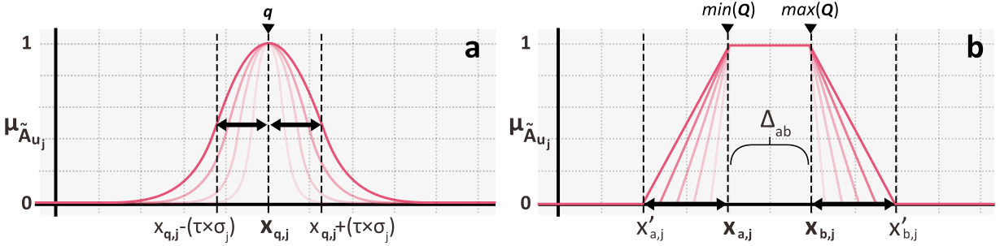
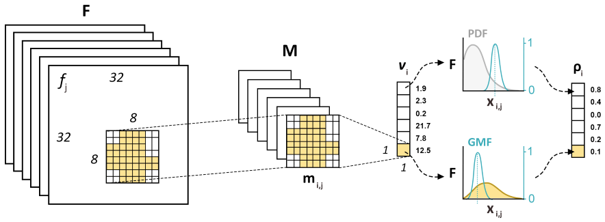
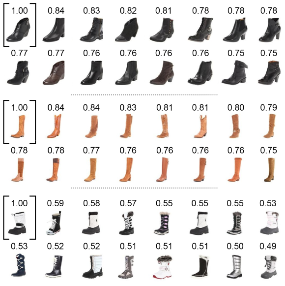
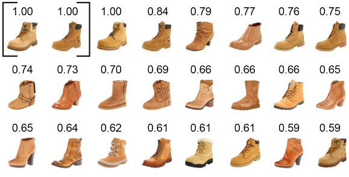
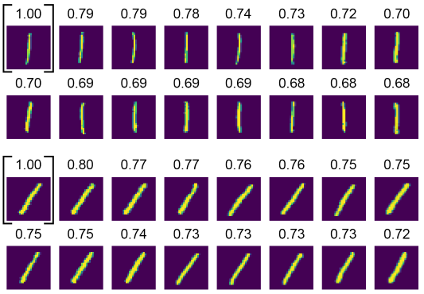
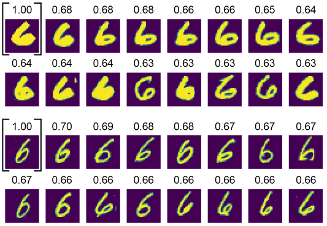

# Object-based Probabilistic Similarity Evidence (OPSE) of Latent Features from FCNs

OPSE is an algorithm processing the latent characteristics of fully convolutional networks (FCNs) to group objects with analogous properties. Its application is demonstrated using the UT Zappos50K datasets. A similarity analysis is carried out in 2 steps: (1) extracting feature patterns per object from a trained FCN, and (2) find the most similar patterns by fuzzy inference.

*Keywords: object, similarity, fuzzy inference, convolutional neural networks, segmentation*

### Feature extraction and transformation procedures
Two types of membership functions are implemented, notably the Gaussian (a) and trapezoidal (b) functions:


The object-oriented extraction of a feature m_(i,j) (yellow mask) from an activated feature f_(j) is done for a set of features F:


### Similarity search
Examples of probabilistic similarity results for single queries (indicated by black square brackets) using a Gaussian membership function:

Average values are indicated in decreasing order from top left to bottom right. Only 16 objects are shown per search.

Example of probabilistic similarity results for two queries (indicated by black square brackets) using a trapezoidal membership function:

Average values are presented in decreasing order from top left to bottom right. Only 24 objects shown.

Examples of similarity results for the queried digit “1”, using a Gaussian membership function and ResNet50 as feature extractor:


Note the difference of digit orientation between the results of the two similarity queries.

Examples of similarity results for the queried digit “6”, using a Gaussian membership function and ResNet50 as feature extractor:


Note the difference of line thickness between the results of the two similarity queries.

# How to use

The package consist of the source files in `src`, separated from `config.py` which configures e.g. the learning model to restore, the convolutional layers to analyse, and the type of statistices calculate from features. All functions required to analyze, extract and transform features from convolutional layers are defined in `functions.py`.

The convolutional layers to analyze for feature extraction are indicated in `config.py`:
```python
# Convolution layers analyzed for similarity analysis.
# Based on a previously trained UNet architecture.
CONV_LAYERS = sorted(
    ['conv11', 'conv21', 'conv31', 'conv41', 'conv51',
     'conv61', 'conv71', 'conv81', 'conv91', 'conv12',
     'conv22', 'conv32', 'conv42', 'conv52', 'conv62',
     'conv72', 'conv82', 'conv92'])
```

The type of statistics used to describe the network features are indicated by:
```python
STAT_TYPES = ['mean', 'std', 'cv']
```
`std` means standard deviation, and `cv` is the coefficient of variation. Both can be used, in combination to the mean, to analyse the similarity.
