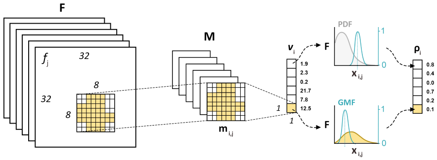
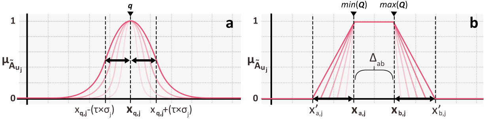

# Object-based Probabilistic Similarity Evidence (OPSE) of Latent Features from FCNs (see [arXiv paper](https://arxiv.org/abs/2307.13606))

OPSE is an algorithm processing the latent characteristics of fully convolutional networks (FCNs) to group objects with analogous properties. Its application is demonstrated using the UT Zappos50K datasets. A similarity analysis is carried out in 2 steps: (1) extracting feature patterns per object from a trained FCN, and (2) find the most similar patterns by fuzzy inference.

**Keywords:** _object, similarity, fuzzy inference, convolutional neural networks, segmentation_

# How to use
The package consist of the source files in `src`, among which (1) `model.py` represents the learning model used, (2) `analyzer.py` defined the analyzer object used to extract, transform and analyze features from the model's convolutional layers, and (3) `signals.py` consists of plotting tools used to evaluate the transformed features into various graphs.
Note that prior to collecting features from a model, the analyzer must be configured. The file `config.py` determines (1) which convolutional layers to analyse, (2) the type of statistics calculated from features (transformation), or signals, (3) the model restored and (4) the segmentation class considered in feature value extraction. The end-user functions are defined in `functions.py` by order of usage. They must be triggered in a Python console individually.

Convolutional layers considered in feature extraction, as indicated in `config.py`:
```python
# Based on a previously trained UNet architecture.
CONV_LAYERS = sorted(
    ['conv11', 'conv21', 'conv31', 'conv41', 'conv51',
     'conv61', 'conv71', 'conv81', 'conv91', 'conv12',
     'conv22', 'conv32', 'conv42', 'conv52', 'conv62',
     'conv72', 'conv82', 'conv92'])
```

The type of statistical transformation of the network features are indicated by:
```python
STAT_TYPES = ['mean', 'std', 'cv']
```
`std` means standard deviation, and `cv` is the coefficient of variation. Both can be used, in combination to the mean for evaluation the objects similarity.


## Feature extraction and transformation procedures
The object-oriented extraction of a feature $m_{i,j}$ (yellow mask) from an activated feature $f_j$ is done for a set of features F from a given layer (e.g., `conv11`). A statistical transformation is performed to obtaine the feature vector $v_i$, which further converted into a probabilistic similarity vector $ρ_i$. This conversion is done after fuzzifying the probability density function (PDF) of every feature component indexed $j$, whose value for an $i$th object is $x_{i,j}$. If we were to evaluate the similarity analysis of an object indexed using a Gaussian membership function (GMF), its feature value $x_{q,j}$ calculated from a cropped feature $m_{q,j}$ would correspond to the center of that function.



Two types of membership functions are implemented, notably the Gaussian (a) and trapezoidal (b) functions written $μ_{A ̃_{u_j}}$. They both transform the value of a feature $j$ for a given object query $q$, denoted as $x_{q,j}$.



## Examples of similarity analysis using benchmark datasets
|  |
|:--:|
| Probabilistic similarity results for single queries (indicated by black square brackets) using a Gaussian membership function. Average values are indicated in decreasing order from top left to bottom right. Only 16 objects are shown per search. |

|  |
|:--:|
| Probabilistic similarity results for two queries (indicated by black square brackets) using a trapezoidal membership function. Average values are presented in decreasing order from top left to bottom right. Only 24 objects shown. |

|  |
|:--:|
| Similarity results for the queried digit “1”, using a Gaussian membership function and ResNet50 as feature extractor. Note the difference of digit orientation between the results of the two similarity queries. |

|  |
|:--:|
| Similarity results for the queried digit “6” using a Gaussian membership function and ResNet50 as feature extractor. Note the difference of line thickness between the results of the two similarity queries. |

## Examples of similarity analysis of minerals from micro-photographs 
Experiments with the OPSE algorithm were performed as part of a collaborative research on zircon grains at  (2021).

|  |
|:--:|
| Example of an RGB micro-photograph of mineral grains with corresponding annotations (A) (morphological erosion applied; background in white) and pixel predictions (P). Scanning-Electron-Microscope Backscatter images indicated three different minerals in this sample: grains marked by black squares are mostly apatite grains, yellow dots are monazites, and unmarked grains are zircons.

|  |
|:--:|
| Examples of probabilistic similarity measures of mineral grains identified by U-Net; average values are indicated above each object frame and presented in decreasing order.|

|  |
|:--:|
| Examples of mean activations calculated per segmented grain and projected in 3D feature spaces. 39 clusters are displayed, each corresponding to a pool of similar grains within a probabilistic value range. Features are indicated per axis.

## License
This library is licensed under the [LICENCE](https://github.com/cjuliani/probabilistic-similarity-evidence-FCN/blob/master/LICENSE)
